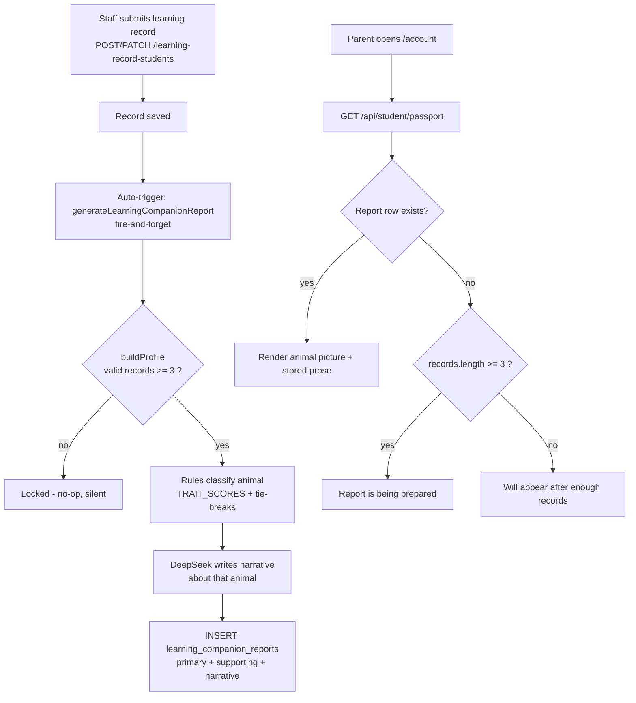

# ADR-003: Learning Companion Page — Stored Architecture + Auto-Generation at 3 Records

| Field | Value |
|-------|-------|
| **Status** | Accepted |
| **Date** | 2026-09-11 |
| **Decision Maker** | mrcoffeespoon |
| **Related** | ADR-002 (amends Decision 2 — overall threshold 5 → 3), ADR-001 |

---

## Context

The supervisor's job list includes the Learning Companion surface of the student portal. A grilling session (2026-09-11) set out to design it against a 3-layer separation (presentation / domain / data), with an initial assumption that the companion classification would need to be built as real-time rules.

Codebase exploration showed the feature is **already ~90% built** — it arrived with the supervisor's main-branch update:

- **Data:** `learning_companion_reports` (migration: `ClassZ-api/scripts/run-learning-companion-reports-migration.js`) stores `primary_companion`, `supporting_companions`, `algorithm_json`, `narrative_json`, `status`, `records_used/required`, `validation_log`. A seeded row exists for profile 102 (`test@student.com`): status `ready`, primary `Rabbit`, supporting `["Turtle","Owl"]`, 14 records used.
- **Domain:** `ClassZ-api/helpers/learningCompanion/buildProfile.js` is the rule-based classifier (TRAIT_SCORES maps learning approaches → 6 animals; tie-break chain; max 2 supporting companions). `generateNarrative.js` writes the prose via DeepSeek (`deepseek-chat`, `DEEPSEEK_API_KEY`). Orchestration: `helpers/learningCompanion/index.js` → `generateLearningCompanionReport`.
- **Presentation:** `/account` (`CompanionHome`), `/account/analytical-insight`, `/account/supporting-learning` in `ClassZ-Website/components/account/student-shell.tsx`, fed by `GET /api/student/passport` (`studentController.getPassport` → `mapReport` returns the full companion object). Picture mapping: `lib/learning-companion-animals.ts` (`resolveCompanionAnimal`, hero + 6 poses per animal, Chinese-title handling). Assets: `public/assets/learning-companion/<animal>/`.

What was genuinely missing: (1) a decision on whether classification is stored or recomputed, (2) any generation trigger other than a manual staff click (`learning-record-students-table.tsx` single/bulk buttons → `POST /learning-record-students/:profileId/generate-report`), (3) verification that the shipped UI matches the design.

---

## Architecture Pattern Assessment — 3-layer separation

| Layer | Component | State |
|---|---|---|
| **Data** | `learning_companion_reports` table; no companion columns elsewhere | Exists, unchanged — **no schema change in this ADR** |
| **Domain** | `buildProfile.js` (deterministic classification), `generateNarrative.js` (DeepSeek prose), `generateLearningCompanionReport` orchestrator | Exists; threshold change (5 → 3) + auto-trigger hook added |
| **Presentation** | 3 pages in `student-shell.tsx` + `learning-companion-animals.ts` resolver + assets | Exists; view-only, renders stored report only |

Key architectural point confirmed during grilling: **classification and prose are generated together in one pipeline** — DeepSeek writes about the animal the rules picked. Recomputing classification at read time (the original proposal) would desync the picture from the prose, so the page must treat the stored report as the single source of truth.

---

## Decision 1: Classification comes from the stored report — never recomputed

**Decision:** The page reads `primary_companion` / `supporting_companions` from the latest `learning_companion_reports` row. No real-time classification runs on read.

### Alternatives Considered

| Option | Pros | Cons | Verdict |
|--------|------|------|---------|
| **A. Stored only (chosen)** | Picture and DeepSeek prose always agree (prose is written *about* the stored animal); zero new code; what the pages already do | Companion only changes when the report regenerates | ✅ |
| B. Real-time recompute in `getPassport` | Always reflects latest records | Picture can desync from prose (rules now say Fox, prose says Rabbit); `getPassport` lacks the normalization pipeline `buildProfile` needs | ❌ |
| C. Hybrid (stored + real-time preview before first report) | Companion appears the moment threshold is hit | Two code paths; preview may differ from eventual report (`previous_primary` tie-break) | ❌ |

### Context
User initially proposed real-time rules; grilling surfaced that stored classification already exists and that prose-animal consistency outweighs freshness.

### Consequences
- **Positive:** self-consistent page; single source of truth; no backend read-path change.
- **Negative:** no report row = waiting state regardless of record count (mitigated by Decision 2 auto-trigger + Decision 5 copy).
- **Review trigger:** parents report stale companions for long-active students → revisit refresh cadence in Decision 2.

---

## Decision 2: Auto-generate at ≥3 valid records; refresh on every record added

**Decision:** After a successful record create/update/import, the API fire-and-forget-calls `generateLearningCompanionReport` for the affected profile. Generation unlocks at **3 valid records** (validity already requires a mapped learning approach — `validate_record` rejects empty `learning_approaches`, `TRAIT_SCORES` only scores known approaches). Every subsequent record re-runs generation (self-healing). Staff single/bulk generate buttons remain as manual override and for language switches.

### Alternatives Considered

| Option | Pros | Cons | Verdict |
|--------|------|------|---------|
| A. Manual only (status quo) | Human reviews prose before parents see it | Report may never be generated; page dead despite enough records | ❌ |
| **B. Auto at threshold + every save (chosen)** | Always fresh; failures self-heal on next record; no staff discipline needed | **No human review** — DeepSeek prose reaches parents unreviewed; ~1 DeepSeek call per recorded lesson | ✅ |
| C. Lazy on parent view | Generates only when viewed | First view = waiting; background-job infra; still no review gate | ❌ |
| H2. First-auto only, manual refresh after | 1 call per student lifetime | Single DeepSeek failure strands the page until staff notice | ❌ |

### Context
User explicitly chose hands-off automation over the human-review gate.

### Consequences
- **Positive:** companion page lights up without staff action; report tracks the latest ≤10-record window (`MAX_RECORDS_USED = 10`) forever.
- **Negative:** unreviewed AI prose about a child reaches parents, and *changes* after lessons; DeepSeek cost per record save (small); if `DEEPSEEK_API_KEY` is missing, generation silently produces no narrative until the next save (the existing `getPassport` warn log flags this state).
- **Review trigger:** centre complains about unreviewed/changed prose → add draft→publish states (reuse `status` column) or revert to manual refresh.

**Implementation notes:**
- Hook lives in `ClassZ-api/controllers/admin/adminActivityLearningRecordController.js` after `createLearningRecordStudent`, `updateLearningRecordStudent`, `importLearningRecordStudents` (routes: admin `POST /learning-record-students`, `POST …/import`, `PATCH …/:profileId`; centre-portal mirrors under `requireCenterStaffWrite`).
- Fire-and-forget: catch + log; a generation failure must never fail the record save.
- Locked result (`<3` valid) is an expected no-op, not an error.
- `MIN_RECORDS_FOR_CONSISTENT = 6` is untouched — the "consistent pattern" status still needs 6.

---

## Decision 3: One threshold — companion and Overall Picture both unlock at 3 (amends ADR-002 D2)

**Decision:** `MIN_RECORDS_FOR_RESULT` changes **5 → 3** in `buildProfile.js` as a single shared constant. The dashboards' Overall Picture (`/more` AI cards, which gate on narrative presence) consequently unlocks at 3 records too. ADR-002 Decision 2's overall state machine becomes `<3` early / `≥3` established.

### Alternatives Considered

| Option | Pros | Cons | Verdict |
|--------|------|------|---------|
| A. Split thresholds (companion 3, Overall Picture 5) | Cross-program claims keep more evidence; ADR-002 intact | Two constants; needs a records-count gate added to `/more` so early narrative doesn't leak | ❌ |
| **B. Single threshold 3 (chosen)** | One rule everywhere; no frontend gate needed; simpler mental model | "Differences across programmes" can now be asserted from 3 data points | ✅ |

### Context
User preferred one rule over gated complexity, accepting thinner evidence for cross-program statements.

### Consequences
- **Positive:** one edit (`buildProfile.js` line 9) drives `build_profile` lock, the generate-endpoint 400 check, and the `getPassport` diagnostic log; no `/more` frontend change needed.
- **Negative:** pattern claims across programmes from 3 records are statistically thin; ADR-002's carefully-argued 5-record evidence bar is relaxed.
- **Review trigger:** AI makes weak/contradictory cross-program claims at 3–4 records → split thresholds (Option A) or raise to 4/5.

**Not affected:** the *per-program* badge state machine (1 = Early, 2 = Emerging, ≥3 = Established) from ADR-002 — per-program counts are a separate mechanism and stay as they are.

---

## Decision 4: Existing pages stand — smoke test before any rebuild

**Decision:** The three shipped pages (`/account`, `/account/analytical-insight`, `/account/supporting-learning`) are treated as the v1 UI. Verification = smoke test with `test@student.com` (Rabbit + Turtle/Owl + seeded prose); only surfaced diffs become capture/rebuild work. No Figma capture exists for these pages yet.

### Alternatives Considered

| Option | Pros | Cons | Verdict |
|--------|------|------|---------|
| **A. Smoke test first (chosen)** | Zero wasted work if pages are right; produces a concrete capture-request list | One extra round-trip | ✅ |
| B. Rebuild all three from fresh captures now | Capture-first rule, applied strictly | May redo correct work; captures exported blind | ❌ |
| C. Declare final as-is | Zero work | Unverified fidelity | ❌ |

### Consequences
- **Positive:** no speculative UI work; the `1009` capture round stays the model for any fixes.
- **Negative:** fidelity is unverified until the smoke test happens.
- **Review trigger:** smoke test surfaces diffs → request captures by node ID into `figma prompt/`, fix per the figma-fidelity workflow.

---

## Decision 5: Waiting copy differentiates by record count

**Decision:** Frontend-only, in `CompanionHome`: when no report row exists —
- `records.length >= 3` → "report is being prepared, check back soon" (the auto-trigger makes this truthful within one save + generation)
- `records.length < 3` → current copy ("will appear here after the centre confirms enough learning records")

### Alternatives Considered

| Option | Pros | Cons | Verdict |
|--------|------|------|---------|
| **A. Differentiate (chosen)** | Honest copy; direct parent-facing counterpart of Decision 2 | Two copies to maintain; `records.length` is a raw count, not the validated count | ✅ |
| B. One generic waiting state | Simplest | Misleading for ≥3-record families ("where is it?") | ❌ |
| C. Also suppress the picture when prose is missing | Avoids half-filled page | Hides the one thing that IS ready | ❌ |

### Consequences
- **Positive:** parents can tell "not enough data yet" from "generation pending/failed".
- **Negative:** raw `records.length ≥ 3` can over-promise if some records are invalid (backend validation is stricter); S1 (report row, no prose) keeps showing picture + waiting prose.
- **Review trigger:** parents of students with invalid-heavy records see "being prepared" indefinitely → use `companion.status`/validation data instead of raw count.

---

## Consequence Summary

### Schema Changes Required

| Change | Type | Risk |
|---|---|---|
| None | — | — |

(`records_required` is data, not schema: new rows will store 3 via the constant; old rows keep their stored value — display-only artifact. The migration scripts' `DEFAULT 4` is unrelated; inserts always write explicitly.)

### New API Endpoints

None. Changed behaviour:

| Item | Change |
|---|---|
| `ClassZ-api/helpers/learningCompanion/buildProfile.js` | `MIN_RECORDS_FOR_RESULT` 5 → 3 |
| `ClassZ-api/controllers/admin/adminActivityLearningRecordController.js` | auto-trigger after create/update/import (fire-and-forget `generateLearningCompanionReport`) |
| `studentController.getPassport` warn log | threshold follows the constant automatically |

### New UI Pages

None. Changed behaviour:

| Item | Change |
|---|---|
| `student-shell.tsx` `CompanionHome` | differentiated waiting copy at `records.length >= 3` |

### Open items (explicitly not in this ADR)

1. Smoke test of the three pages (Decision 4) — capture requests follow only if diffs appear.
2. Work Sample page (supervisor job #2) — separate effort; `algorithm_json` already returned by `mapReport` may feed it.
3. S1 polish (picture + waiting prose mix) — accepted for now.

---

## Review Triggers

| Condition | Revisit |
|---|---|
| Centre complains about unreviewed / changing AI prose | D2 → draft→publish states, or manual refresh only |
| Weak cross-program claims at 3–4 records | D3 → split thresholds or raise bar |
| Smoke test surfaces UI diffs | D4 → capture + rebuild round |
| "Being prepared" copy shown indefinitely for invalid-heavy records | D5 → gate on validated count / `companion.status` |
| Parents report stale companions for long-active students | D1/D2 → refresh cadence |
