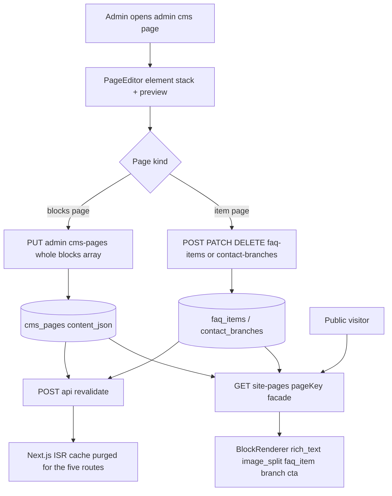

# ADR-004: CMS Per-Element Editing for the Five Info Pages

| Field | Value |
|-------|-------|
| **Status** | Accepted |
| **Date** | 2026-09-17 |
| **Decision Maker** | mrcoffeespoon |
| **Related** | `API-GAP-AUDIT.md` (workspace root), ADR-003, ADR-002, ADR-001 |

---

## Context

The supervisor's update stated: *"some table or info of admin account / front page has been updated while the database and API have not been updated yet"*. The audit (`API-GAP-AUDIT.md`) established the actual state:

- **Two competing CMS systems exist in the codebase.** Model A — dedicated singleton tables (`about_page`, `terms_page`, `privacy_page`, `faq_page` + `faq_items`, `contact_page` + `contact_branches`) with fully written controllers (`staticPageController`, `adminStaticPageController`, `adminContactController`) that are **mounted nowhere**. Model B — generic `cms_pages` (page_key / title_zh / title_en / content_json) whose public and admin endpoints **are mounted**, but whose table is **empty**.
- **The data layer already carries the updated design.** `about_page.content_json` holds the new front-page content in a typed block schema (`schemaVersion: 1`, blocks with `layout: split-image-left|split-image-right`, id `b-home-about-1`) with inline translations (`body_html`, `body_html_zh_tw`, `body_html_zh_cn`). `adminStaticPageController` validates exactly that schema (`HOME_ABOUT_SCHEMA_VERSION`, `ALLOWED_HOME_ABOUT_LAYOUTS`).
- **All five public pages are hard-coded JSX** (`app/about`, `app/terms`, `app/privacy`, `app/faqs`, `app/contact-us` via components in `components/info/`), and the admin CMS pages (`app/admin/cms/*` → `CmsPageForm`) save to a **local demo store** (`lib/classz-admin-store.ts`) — no API calls at all.
- Section A (4 missing endpoints) and Section B (content seeding: 21 FAQ items, 2 branches, class tag catalogue) are **done and applied to local + Railway**.

The requirement now is explicit: *"we need a UI with it and this UI should be able to change per element"*. That is the decision this ADR records, resolved through a grilling session on 2026-09-17.

---

## Architecture Pattern Assessment — presentation / domain / data

| Layer | Component | State |
|---|---|---|
| **Presentation (public)** | Five routes become server components; `components/cms/block-renderer.tsx` renders blocks below each page's existing static hero shell | New |
| **Presentation (admin)** | `components/admin/page-editor/*` — element stack + per-type forms + language toggles + live preview pane; replaces demo-store `CmsPageForm` | New |
| **Domain** | `GET /api/site-pages/:pageKey` facade assembles **one uniform `{blocks:[…]}` payload** per page regardless of storage; block-type schema + validation; item reorder semantics | New |
| **Data** | `cms_pages` rows for about/terms/privacy; `faq_page` + `faq_items` for FAQ; `contact_page` + `contact_branches` for contact. Singleton `about_page`/`terms_page`/`privacy_page` retired after content migration | Mixed (exists + migrate) |

Key architectural insight established during grilling: **"per element" is an editing experience, not a persistence requirement.** The editor treats every element as a first-class unit (add, edit, reorder, delete, preview), while persistence stays atomic per page for block pages and row-level for item pages. This avoids a canvas/CMS-framework build while delivering the requested UX.

---

## Decision Summary

| # | Decision | Outcome |
|---|---|---|
| 1 | Scope | Five info pages: about, terms, privacy, FAQ, contact. Home page stays code-only but may embed the about blocks read-only |
| 2 | Element model | Typed blocks + generic `rich_text` fallback |
| 3 | Storage | Hybrid — `cms_pages` for about/terms/privacy; relational rows for FAQ items and branches; facade unifies the read |
| 4 | i18n | Inline suffixed fields (`_zh_tw` / `_zh_cn`) per translatable field; fallback locale → English |
| 5 | Persistence | Per-element UI, page-level save, explicit Save button; no autosave, no draft/publish in v1 |
| 6 | Editor UI | Element stack cards + live preview pane reusing the public renderer; ↑↓ reorder |
| 7 | Public rendering | ISR (`revalidate = 60`) + authenticated on-demand revalidation hook after saves |
| 8 | FAQ depth | `faq_item` block gains optional `images[]`; tabs + accordions preserved (no content regression) |
| 9 | Migration & rollout | Local-first dual-dialect migration + seed extension + singleton→`cms_pages` data migration; then Railway |

---

## Decision 1: Scope — five info pages

**Decision:** Per-element CMS editing covers exactly `about`, `terms`, `privacy`, `faqs`, `contact-us`. The home page (`app/page.tsx`) remains code-only in v1, but may embed the about page's blocks read-only so updated front-page content still reaches visitors.

### Alternatives Considered

| Option | Pros | Cons | Verdict |
|---|---|---|---|
| **Five info pages (chosen)** | Matches every existing table/controller; small block taxonomy; shippable | Home page edits still need a deploy | ✅ |
| Five pages + front-page sections | Home hero/features editable; the seeded `b-home-about-1` block suggests home consumption | Home sections are bespoke components — taxonomy and editor balloon | ❌ v2 |
| All content incl. news/blog | One CMS everywhere | `news` is relational with dates — different editing paradigm | ❌ |

### Context
Grilling determined the primary consumers are content editors making occasional changes, not a daily publishing operation.

### Consequences
- **Positive:** scope matches `cms_pages` + `faq_*` + `contact_*` exactly; no new page-type abstraction needed.
- **Negative:** home-page copy changes still require a developer.
- **Review trigger:** if home-page edits are requested more than roughly monthly, add home section blocks (extends Decisions 2 and 6, not 3).

---

## Decision 2: Element model — typed blocks + `rich_text` fallback

**Decision:** Content is a list of typed blocks. Initial taxonomy:

| Block type | Fields (i18n fields marked †) | Used by |
|---|---|---|
| `rich_text` | `title`†, `body_html`† | any page |
| `image_split` | `image_url`, `image_alt`†, `layout` (`split-image-left` \| `split-image-right`), `body_html`† | about, terms, privacy |
| `faq_item` | `question`†, `answer_html`†, `images[]` (Decision 8) | faqs |
| `branch` | `name`†, `address`†, `hours`†, `map_query`, `image_url`, `display_order` | contact |
| `cta` | `label`†, `href`, `style` | any page |

Block envelope matches the already-seeded pattern: `{ id, type, schemaVersion: 1, ...typeFields }` (cf. `b-home-about-1`).

### Alternatives Considered

| Option | Pros | Cons | Verdict |
|---|---|---|---|
| **Typed + `rich_text` fallback (chosen)** | Structure where it pays; new content needs no code deploy | Two "kinds" of block for admins | ✅ |
| Fixed typed blocks only | Fully predictable | Every new section shape = code change | ❌ |
| Freeform rich text only | Simplest editor | No per-element images/layout; FAQ + branch structure lost; admins hand-write HTML | ❌ |

### Context
The seeded about blocks are already typed and the FAQ/branch content is genuinely structured. The fallback exists so marketing can invent a section without engineering.

### Consequences
- **Positive:** the renderer and validator switch on a small closed set; `rich_text` absorbs the long tail.
- **Negative:** `rich_text` blocks can look flat next to typed blocks; admins may need guidance.
- **Review trigger:** repeated use of `rich_text` to emulate a layout block → promote that layout to a typed block.

---

## Decision 3: Storage — hybrid, unified by a facade

**Decision:** about/terms/privacy content lives as block arrays in `cms_pages.content_json` (its mounted CRUD is reused). FAQ items stay in `faq_items`; contact branches stay in `contact_branches` (row-level `is_active` / `display_order`). A new public facade `GET /api/site-pages/:pageKey` returns the same `{ page_key, blocks:[…] }` shape for all five pages.

### Alternatives Considered

| Option | Pros | Cons | Verdict |
|---|---|---|---|
| **Hybrid (chosen)** | True row-level per-element ops for FAQ/branches; reuses mounted cms CRUD *and* the already-written item controllers; nothing seeded is orphaned | Two storage patterns behind the facade | ✅ |
| Pure `cms_pages` | One table, one code path | Orphans 23 freshly seeded rows; loses `is_active`/`display_order` semantics; must port validators | ❌ |
| Pure Model A singletons | Controllers exist | Table-per-page rigidity; new page = DDL; kills the mounted `cms_pages` endpoints | ❌ |

### Context
`faq_items` and `contact_branches` were seeded in Section B precisely because their shape is relational; `contact_branches.center_id` also leaves room for per-centre branches later. Single-editor usage makes whole-page saves acceptable for the three block pages.

### Consequences
- **Positive:** each content type keeps its natural shape; FAQ/branch edits are row-level (ideal for per-element operations); no endpoint becomes dead.
- **Negative:** the facade is a small assembly layer that must stay in sync with two storage shapes.
- **Review trigger:** concurrent editors clobbering the same blocks page, or a requirement for per-centre variants of these pages.

---

## Decision 4: i18n — inline suffixed fields

**Decision:** every translatable field stores its variants inline: `body_html`, `body_html_zh_tw`, `body_html_zh_cn` (plus `title_*`, `question_*`, `name_*`, `address_*`, `hours_*` as applicable). `faq_items` and `contact_branches` gain `_zh_tw` / `_zh_cn` columns in one additive migration. Renderer fallback: requested locale → English. No automatic zh-TW ↔ zh-CN conversion.

### Alternatives Considered

| Option | Pros | Cons | Verdict |
|---|---|---|---|
| **Inline suffixed fields (chosen)** | Identical to the seeded about-block pattern; one row = one element in all languages; editor shows a per-field language toggle | Field count ×3 | ✅ |
| Per-locale page copies | Translators work on whole pages | Structural drift between locales; breaks `page_key` uniqueness; doubles editor work | ❌ |
| English-only v1 | Smallest scope | Immediate zh regression — the static site already serves zh-TW content today | ❌ |

### Context
The site is bilingual now (`locales/en.json`, `locales/zh-TW.json`); zh FAQ/about text exists and can seed the new columns directly. HK audiences are sensitive to TW/CN mixed script, hence no auto-folding.

### Consequences
- **Positive:** translation state is visible per element; partial translations degrade gracefully to English.
- **Negative:** editors see three inputs per text field; untranslated elements silently show English.
- **Review trigger:** zh-CN consistently lagging → consider a per-element "translation status" indicator or TW→CN assistance.

---

## Decision 5: Persistence — per-element UI, page-level save

**Decision:** the editor loads the page, allows unrestricted client-side element add/edit/reorder/delete, and persists on an explicit **Save**: one `PUT /api/admin/cms-pages/:key` (whole blocks array) for block pages; individual row create/update/delete for `faq_item` and `branch` elements. No autosave, no draft/publish workflow in v1.

### Alternatives Considered

| Option | Pros | Cons | Verdict |
|---|---|---|---|
| **Per-element UI, page-level save (chosen)** | Atomic writes; reuses mounted `PUT`; simplest correct mental model | Unsaved work lost on tab close; last-write-wins | ✅ |
| Strict per-element persistence | Nothing lost between edits; concurrent-safe | Many more endpoints; half-edited public states unless drafts exist (large scope jump) | ❌ v2 |

### Context
Single-editor usage was confirmed during grilling; the FAQ/branch editors are inherently row-level anyway.

### Consequences
- **Positive:** no partial pages ever go live; small API surface (one changed endpoint + mounted item CRUD).
- **Negative:** a closed tab loses unsaved changes; two editors can overwrite each other.
- **Review trigger:** first lost-work incident or a second regular editor → introduce autosave and/or drafts.

---

## Decision 6: Admin editor UI — element stack + preview pane

**Decision:** a new `PageEditor` in `components/admin/page-editor/`:
- vertical **element stack** — one card per element (type badge, summary line), expand to a per-type form with a per-field **language toggle** (en / zh-TW / zh-CN, showing which variants are filled);
- per-card **↑↓ reorder**, duplicate, delete; "Add element" type picker;
- **preview pane** that imports the *public* `BlockRenderer` and renders the current draft state (no separate preview code path);
- **sticky Save bar** with dirty-state indicator; FAQ/contact variants use the same shell with header fields bound to `faq_page` / `contact_page` and the stack bound to item rows.

### Alternatives Considered

| Option | Pros | Cons | Verdict |
|---|---|---|---|
| **Stack + preview pane (chosen)** | Real preview for ~20% of WYSIWYG cost by reusing the public renderer; zero canvas machinery; no new dependencies (↑↓ v1) | Preview lacks the page's hero/footer context | ✅ |
| WYSIWYG canvas | Most intuitive | DOM↔block mapping, overlay editing, responsive framing — months of work, brittle | ❌ |
| Long form / tabs per block | Fastest to build | Weakest "per element" match; painful reordering; no orientation for admins | ❌ |

### Context
The renderer from Decision 7 must exist regardless, which is what makes the preview pane nearly free. Admins are content editors, not designers — cards give them guardrails.

### Consequences
- **Positive:** preview is always faithful to publishing logic because it *is* the publishing logic; reorder without drag-and-drop dependencies.
- **Negative:** preview is not literally the page in context; editor needs careful draft-state handling (dirty tracking, unsaved-changes guard).
- **Review trigger:** admins repeatedly surprised by the published result → consider in-context editing.

---

## Decision 7: Public rendering — ISR + revalidation hook

**Decision:** the five routes become server components that fetch `GET /api/site-pages/:pageKey` (server-side, direct to the API) with `export const revalidate = 60`, rendering `BlockRenderer` inside each page's existing static shell (hero/headers stay code). Backend save handlers call a new authenticated `POST /api/revalidate` (secret-checked) so saves publish within seconds.

### Alternatives Considered

| Option | Pros | Cons | Verdict |
|---|---|---|---|
| **ISR 60s + hook (chosen)** | Static-class speed, SEO-safe, survives API downtime (serves last good render), near-instant publish | One extra Next route + a call from each save handler | ✅ |
| SSR per request | Always exactly what was saved | API latency per view; API outage = page outage | ❌ |
| Client-side fetch | Simplest pages; outage-tolerant | Content absent from initial HTML (SEO regression on marketing pages); loading flicker | ❌ |

### Context
These are customer-facing marketing pages where SEO and load speed matter; the API is low-traffic, but static delivery is free performance.

### Consequences
- **Positive:** publish appears live almost immediately; no user-visible failure mode when the API hiccups; SEO unchanged.
- **Negative:** a failed revalidation still leaves ≤60s staleness; one more secret to manage.
- **Review trigger:** `REVALIDATE_SECRET` rotation/mismanagement, or frequent save-then-check confusion → reduce revalidate window or make the hook mandatory-verified.

---

## Decision 8: FAQ depth — enriched `faq_item`

**Decision:** `faq_item` blocks gain an optional `images[]` field (`{ src, alt }`) so step-by-step walkthroughs (e.g. the register/enrol screenshots) survive the move to DB-driven rendering. The FAQ renderer keeps the parents/centres **tabs** (grouped by the seeded `display_order` convention: parents < 100 ≤ centres) and accordion behavior.

### Alternatives Considered

| Option | Pros | Cons | Verdict |
|---|---|---|---|
| **Enriched `faq_item` (chosen)** | Content parity; galleries become editable per element; fits "change per element" | Small image-list sub-editor; seed extension to attach existing screenshots | ✅ |
| DB-driven, simple | Least work | Visible regression — the walkthrough screenshots are the page's most useful content | ❌ |
| `/faqs` stays static | Zero regression | FAQ editor edits content nobody displays; facade item-assembly ships untested | ❌ |

### Context
The existing screenshots (`public/Q1_1.png`…`Q8_2.png`) are already in the repo and can be seeded into the new field; `POST /api/admin/uploads` covers new uploads.

### Consequences
- **Positive:** no user-visible content loss; gallery editing is per element like everything else.
- **Negative:** one more sub-editor component; block schema grows.
- **Review trigger:** if galleries go unused by editors for a long period, consider folding them into `rich_text`.

---

## Decision 9: Migration and rollout

**Decision:** dual-dialect migration + seed extension + singleton→`cms_pages` data migration, validated locally then applied to Railway using the documented `.env.railway` flow (never `db:init`).

**Schema/DDL**
- **New migration** `scripts/run-site-content-i18n-migration.js` (+ `db:migrate:site-content-i18n`), additive:
  - `faq_items`: `question_zh_tw`, `question_zh_cn`, `answer_html_zh_tw`, `answer_html_zh_cn`, `images_json`
  - `contact_branches`: `name_zh_tw`, `name_zh_cn`, `address_zh_tw`, `address_zh_cn`, `hours_zh_tw`, `hours_zh_cn`
  - `schema.sql` updated + `schema.pg.sql` regenerated via `scripts/generate-pg-schema.js`

**Data migration** `scripts/run-site-pages-to-cms-migration.js` (idempotent):
- `about_page.content_json` → `cms_pages` row `page_key='about'` (blocks carried over verbatim; titles from `about_page.title`)
- `terms_page.content_html` → `cms_pages('terms')` as a single `rich_text` block
- `privacy_page.content_html` → `cms_pages('privacy')` as a single `rich_text` block
- Extension of `scripts/seed-site-content.js`: zh variants for FAQ items and branches sourced from `locales/zh-TW.json`; `images_json` for the walkthrough items (`Q1_*`, `Q2_*`, `Q81/Q82`, `q7.png`)
- Singleton tables (`about_page`, `terms_page`, `privacy_page`) are **left in place but retired** — no drops in v1

### Alternatives Considered

| Option | Pros | Cons | Verdict |
|---|---|---|---|
| **Migrate + retire singletons (chosen)** | One canonical home per page; no data loss; reversible (tables kept) | Two places hold about content until a future cleanup | ✅ |
| Drop singletons immediately | Clean | Destroys the seeded source content — no rollback path | ❌ |
| Re-seed content by hand | No migration script | Hand-transcription errors; zh content lost | ❌ |

### Context
Railway holds live data (78 users, 244 classes); migrations are additive and idempotent per repo conventions, and the same script runs against both targets.

### Consequences
- **Positive:** content moves without loss; Railway and local stay in lockstep; rollback is "point the facade back at the singleton".
- **Negative:** about content briefly exists in two tables; cleanup deferred.
- **Review trigger:** after one full release cycle with no rollback → drop the retired singletons in a follow-up migration.

---

## Consequence Summary

### Schema changes required

| Object | Change | Type | Risk |
|---|---|---|---|
| `faq_items` | +5 columns (`question_zh_tw/cn`, `answer_html_zh_tw/cn`, `images_json`) | Additive | Low |
| `contact_branches` | +6 columns (`name_zh_tw/cn`, `address_zh_tw/cn`, `hours_zh_tw/cn`) | Additive | Low |
| `cms_pages` | +3 rows (`about`, `terms`, `privacy`) | Data | Low |
| `about_page`, `terms_page`, `privacy_page` | Retired (kept, unread) | None | Low |

### New / changed API endpoints

| Endpoint | Purpose | Status |
|---|---|---|
| `GET /api/site-pages/:pageKey` | Public facade, uniform `{blocks:[…]}` for all five pages | New (`publicRoute.js` + `controllers/sitePageController.js`) |
| `POST /api/revalidate` | Purge Next.js cache after save | New (`app/api/revalidate/route.ts`, secret) |
| `GET/PUT /api/admin/cms-pages/:pageKey` | Block pages read/write | Exists — gains block-schema validation |
| `GET/POST /api/admin/faq-items`, `PATCH/DELETE /api/admin/faq-items/:id`, `POST /api/admin/faq-items/reorder` | FAQ item CRUD + reorder | Mount existing `adminStaticPageController` |
| `GET/PUT /api/admin/faq-page` | FAQ page header (title/intro) | Mount existing |
| `GET /api/contact` | Public contact page + active branches | Mount existing `contactController.getContactPublic` |
| `GET/PUT /api/admin/contact-page`, `GET/POST/PATCH/DELETE /api/admin/contact-branches[/:id]`, reorder | Contact header + branch CRUD | Mount existing `adminContactController` |
| `POST /api/admin/uploads` | Block images | Exists (reused) |

### New UI components / pages

| Component | Purpose |
|---|---|
| `components/cms/block-renderer.tsx` + `components/cms/blocks/*` | Public rendering per block type (shared with preview) |
| `components/admin/page-editor/*` | `page-editor`, `element-card`, per-type forms, `language-field`, `image-list-field`, `preview-pane`, `save-bar` |
| `app/admin/cms/{about,terms,privacy,faq,contact}/page.tsx` | Swap `CmsPageForm` (demo store) → `PageEditor` (real API) |
| `app/api/revalidate/route.ts` | On-demand revalidation |
| `app/{about,terms,privacy,faqs,contact-us}/page.tsx` | Server components + `revalidate = 60`, blocks below static shell |
| `lib/classz-admin-store.ts` | Remove the `cms` slice and its demo-only audit entries |

### Implementation phases

| Phase | Work | Depends on |
|---|---|---|
| 1 — Data | i18n migration, seed extension (zh + images), singleton→`cms_pages` migration; run local + Railway | — |
| 2 — API | Facade controller + route, mount FAQ/branch CRUD, block validation in `upsertPage`, revalidate calls | Phase 1 |
| 3 — Public UI | `BlockRenderer` + five route refactors + revalidate route | Phase 2 |
| 4 — Admin UI | `PageEditor` stack, forms, language toggle, image list, preview pane, save bar; wire admin routes | Phase 3 (renderer) |
| 5 — Cleanup | Retire unused Model A handlers, update `API-GAP-AUDIT.md`, note dead singletons | Phase 4 |

---

## Review Triggers

| Condition | Revisit |
|---|---|
| Home-page edits requested more than ~monthly | Decision 1 (extend scope) |
| `rich_text` repeatedly used to fake a layout | Decision 2 (new block type) |
| Multiple concurrent editors, or per-centre page variants needed | Decision 3 (storage) |
| zh-CN content consistently lags zh-TW | Decision 4 (translation workflow) |
| First lost-work incident in the editor | Decision 5 (autosave/drafts) |
| Admins surprised by published output | Decision 6 (in-context editing) |
| Revalidation secret misuse or staleness confusion | Decision 7 (hook policy) |
| Offer galleries unused by editors | Decision 8 (fold into `rich_text`) |
| One release cycle with no rollback needed | Decision 9 (drop retired singletons) |

---

## Architectural Note

The 3-layer separation holds cleanly: **data** keeps each content type in its natural shape (`cms_pages` blobs vs relational item rows) with no layer leaking storage details upward; **domain** owns the block taxonomy, validation, reorder semantics, and the facade that normalizes storage into one payload; **presentation** splits into the admin editor (write, with a preview that reuses the public renderer) and the public block renderer (read). The one deliberate asymmetry — two storage patterns — is fully contained behind the facade, which is the seam that would absorb a future move to a single model without touching presentation code.

---

## Amendments from the implementation review (2026-09-17)

These refine the decisions above after the pre-commit review; they are part of the record.

| # | Amendment | Reason |
|---|---|---|
| A1 | **`/about` wiring is deferred**: the page stays static until real content is authored as blocks. The only seeded block for it is the demo placeholder (`Welcome to our studio` / `歡迎來到我們的舞蹈教室`), which must not reach visitors. The fetch + render wiring is written and can be restored in one commit. | Implemented-and-then-reverted after review (Decision 1 / Decision 9 review trigger) |
| A2 | **FAQ reorder is band-preserving**: `POST /api/admin/faq-items/reorder` renumbers within each item's existing band (parents `5,15,…`, centres `110,120,…`) instead of `display_order = array index`, which collapsed every item into the parents band and made the tabs disappear. | Review blocker #1; regression-tested in `scripts/check-site-pages-api.js` |
| A3 | **Content safety is enforced at write time**, not by a sanitiser: `validateSitePageDoc` rejects `<script>/<iframe>/<object>/<embed>`, inline `on*=` handlers and `javascript:` URLs, and `cta.href` must be a site-relative path or http(s). Broad markup (`p, ul, h3/h4, strong/em/a/img, br`) remains allowed. | Review findings #7/#8 — stored XSS via admin-authored HTML was an unrecorded risk |
| A4 | **`faq_page` / `contact_page` headers remain single-language** (title/intro), so those two fields are the documented exception to Decision 4. | Review finding #15 |
| A5 | **zh-CN is authorable but not yet reachable**: the language provider supports `en` / `zh-TW` only, so zh-CN values are staged for a future locale switch and fall back to English until then. | Review finding #16 |
| A6 | **Cold-cache risk accepted**: if the API is unreachable during a fresh build/first render, `/terms` and `/privacy` can be cached with an empty content region for up to 60s. Mitigation when needed: fail the build on a failed page fetch, or restore a static fallback. | Review finding #5 |
| A7 | **Unsaved-changes guard is `beforeunload` only** — in-app navigation away from a dirty editor is not intercepted. | Review nit; Decision 6's "if cheap" clause |
| A8 | **The demo CMS slice stays** for `/admin/cms/course-intro` (out of scope for this ADR's five pages), so the Consequence Summary line about removing `lib/classz-admin-store.ts`'s `cms` slice applies to the five pages only. | Review nit |
| A9 | **Migration runbook note**: the pages→cms migration uses `FORCE_PAGES_MIGRATION=1` to overwrite the three page rows; only safe before editors have touched the CMS. `db:migrate:all` now includes `site-content-i18n`. | Review findings #10–#12 |
| A10 | **`/admin/cms/course-intro` hidden from the Content nav**: the entry was template scaffolding (May 2026) for a feature that was never built — `course_intros` does not exist, `adminCourseIntroController` is unmounted, and the admin page wrote to the demo store only. Restore it as course data (per-programme rows via a follow-up ADR), not as a generic page. | User decision 2026-09-17 |
