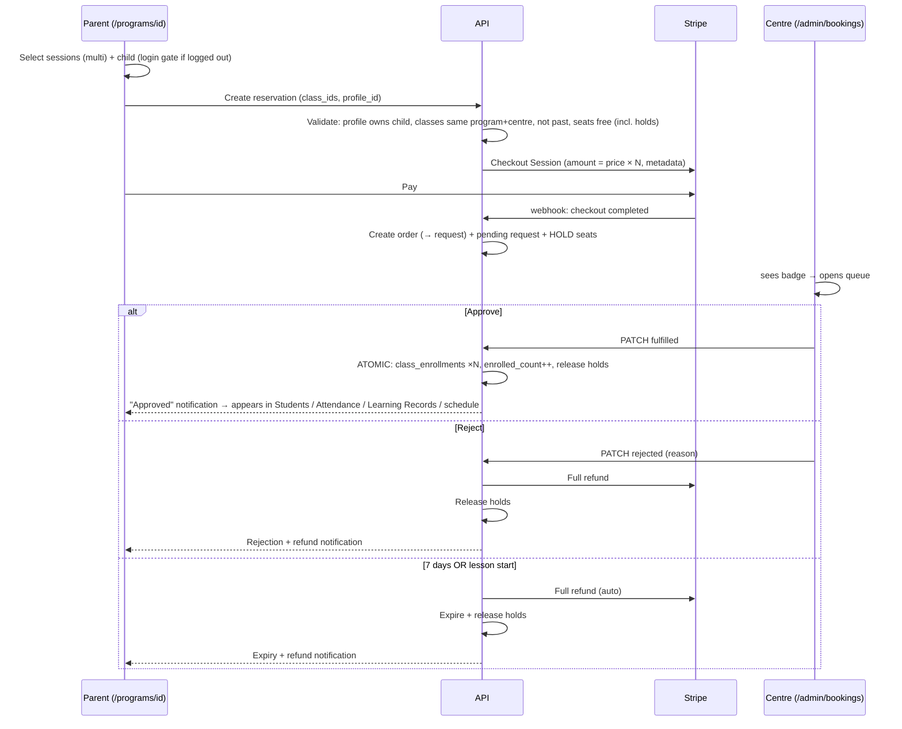

# ADR-005: Lesson Reservation Flow (Parent Pays → Centre Approves)

| Field | Value |
|-------|-------|
| **Status** | Accepted |
| **Date** | 2026-09-25 |
| **Decision Maker** | mrcoffeespoon |
| **Related** | ADR-004, ADR-003, `API-GAP-AUDIT.md`, docs/UI_Changes_2408.md (W9 payment captures note in `class-option-card.tsx`) |

---

## Context

A parent ("student account") must be able to reserve a paid spot in a centre's lesson: on the public program detail page (`/programs/[id]`), pick one or more lesson sessions, pay, and — after the centre confirms — have the child appear in the centre's **Students page, Attendance (lesson picker), and Learning Records**. If the visitor isn't logged in, they must log in first.

What already exists (verified in the codebase, 2026-09-25):

- **Reservation backend, half-wired.** The `enrollment_requests` table (`id, user_id, profile_id, class_id, lesson_class_ids, lesson_count, tokens_required, enrollment_scope ('single_lesson'|'full_course'), status ('pending'|'rejected'|'fulfilled'), rejection_reason, created_at, fulfilled_at`) exists with seed data, plus `GET/PATCH /enrollment-requests` on both admin and centre-portal routes (`adminEnrollmentRequestController.js`). **No production code creates requests** — the only `INSERT` is in `seed-test-centre-admin-demo.js`.
- **An orphaned centre approval UI.** `/admin/bookings` (`bookings-manager.tsx`) lists requests with Approve/Reject buttons — but **no navigation links to it**, and Approve only flips status to `fulfilled`; enrollment creation happens in a separate manual token-assignment step (`adminTokenAssignmentController.js` → `enrollmentTransaction.assignLessonWithTokenPlan`).
- **Money today buys tokens, not lessons.** Stripe Checkout (`/api/payment/checkout-session` + `/api/payment/order-status`, webhook at `/api/payment/webhook`) feeds `orders` → token packages → `user_tokens`. There is **no per-lesson fiat price anywhere**: `courses.price` is the price shown on program cards, `classes` carries only `token_cost`.
- **Centre surfaces are enrollment-driven.** The Learning Record student list, Students CRM, and attendance all join `profiles → class_enrollments → classes` (e.g. `adminActivityLearningRecordController.listLearningRecordStudents`). Creating `class_enrollments` rows is *sufficient* to surface a child in all three.
- **Enroll button points nowhere.** `ClassOptionCard` links Enroll → `/payment`, a route that does not exist (deliberate, per the W10 note: "404 until W9's payment captures land").
- Capacity is enforced as a logic gate at enrollment-creation time (`CLASS_FULL` in `enrollmentTransaction.js:118`, `adminEnrollmentController.js:259`), and past classes are refused (`CLASS_PAST`). The approval PATCH itself performs no checks.

Decisions below were resolved through a grilling session on 2026-09-25.

---

## Decision Summary

| # | Decision | Choice |
|---|----------|--------|
| 1 | Post-payment model | **B — request → centre manually approves**; rejection triggers refund |
| 2 | Payment currency | **A — real card payment (Stripe) per reservation**, captured at request time, refunded on rejection |
| 3 | Pricing rule | `courses.price` **is the per-lesson rate**; total = price × selected session count |
| 4 | Booking scope | **Multi-session selection** within one program (`lesson_class_ids`), per child |
| 5 | Seat safety while pending | **B — pending-seat hold**; 7-day auto-expiry + refund; auto-refund at lesson start |
| 6 | Child per request | **A — one child per request**; login gate = redirect with return URL |
| 7 | Parent-side lifecycle | Status on **`/account/schedule`** (details deferred); **no parent cancel in v1**; auto-refund defaults |
| 8 | Approve mechanics | **A — one-click atomic approve** (creates enrollments or fails loudly); strictly yes/no in v1 |

---

## Decision 1: Approval-gated enrollment (request → centre approves)

**Decision:** A parent's paid reservation creates a `pending` `enrollment_requests` row. The centre manually approves (→ enrollments created) or rejects (→ refund). Payment does **not** confirm the seat by itself.

### Alternatives Considered

| Option | Pros | Cons | Verdict |
|--------|------|------|---------|
| **B: request → manual approve (chosen)** | Centre keeps control over who joins; reuses the existing requests backend and approve/reject UI; refund semantics clean | Parent not enrolled until approval; needs pending-state UX | ✅ |
| A: direct enroll on payment | Instant, matches the literal "centre sees a new student" reading | Bypasses the approval system; centre loses vetting; capacity must be enforced at pay time under concurrency | ❌ |
| C: auto-approve hybrid | Instant + centre veto | Two sources of truth; refund-on-late-reject complexity | ❌ |

### Context
The business wants centres to retain gatekeeping over who attends their lessons, even when money has changed hands.

### Consequences
- **Positive:** Centre trust; the approval queue becomes the producer-less `enrollment_requests` system's missing front door.
- **Negative:** Parents wait for confirmation; requires clear pending-state UX (Decision 7).
- **Review trigger:** If centres find approval latency kills conversion (parents abandoning before approval), revisit auto-approve with post-hoc veto (C).

---

## Decision 2: Fiat card payment per reservation (Stripe), refund on rejection

**Decision:** The payment page charges real money (HKD) via Stripe Checkout for the selected sessions, **captured at request-creation time**. Rejection, expiry, or lesson-start timeout triggers a full Stripe refund.

### Alternatives Considered

| Option | Pros | Cons | Verdict |
|--------|------|------|---------|
| **A: Stripe per reservation (chosen)** | True "pay for this lesson" UX; refund well-defined via Stripe; no dependency on parent token balance | Two currencies now coexist (fiat reservations + token centre-assignments); new order semantics; refund integration is new work | ✅ |
| B: pay with tokens | Reuses everything (tokens_required, token charging, insufficient-tokens email) | Parent must pre-own tokens; "payment" is a token debit, not money; conflicts with the real-money product intent | ❌ |
| C: tokens charged, HKD displayed | B + honest value display | Still the wrong currency underneath | ❌ |

### Context
The product intends pay-as-you-go real-money bookings. The existing token rails remain for the centre-assigned flow; they are **not** reused for parent self-serve reservations.

### Consequences
- **Positive:** Direct commercial model; Stripe handles cards/Link/Apple Pay; refund = `stripe.refunds.create` on the captured PaymentIntent.
- **Negative:** `orders` gains a second purpose (lesson reservations vs token packages); Stripe refund + webhook handling is new; the token path (`tokens_charged`, token assignment) stays alive in parallel, so two enrollment money paths must coexist in the codebase.
- **Review trigger:** If parents later expect prepaid credit packs, fold reservations back into tokens (Decision 2 revisited).

---

## Decision 3 & 4: Per-lesson pricing and multi-session selection

**Decision:** `courses.price` is the **price per lesson**. The parent selects any number of the centre's upcoming sessions within one program; the request records `lesson_class_ids = [selected ids]`, `lesson_count = N`, and the charged amount is `courses.price × N`.

### Alternatives Considered

| Option | Pros | Cons | Verdict |
|--------|------|------|---------|
| **Multi-select at per-lesson price (chosen)** | Matches "click enroll to a lesson session… the date of it"; schema already fits (`lesson_class_ids`, `single_lesson`); no new pricing data | Program detail needs a new multi-select affordance | ✅ |
| Full-course booking at `courses.price` total | Simplest amount math | Contradicts per-session picking; bypasses `lesson_class_ids` machinery | ❌ |
| Full-course booking at price × N | — | Same contradiction, worse math ambiguity | ❌ |

### Context
Course prices in the real centres are per-lesson rates, and parents genuinely pick individual sessions (e.g. 4 of 8 Wednesdays).

### Consequences
- **Positive:** No schema change for pricing; existing `lesson_class_ids` array carries the selection; amount is a pure computation.
- **Negative:** The amount must be **snapshotted onto the request** (with the linked order) so a later `courses.price` change can't mutate what a pending booking is worth or what gets refunded.
- **Review trigger:** If centres demand per-session price overrides (premium workshops), add a nullable `classes.price` and fall back to `courses.price`.

---

## Decision 5: Pending-seat hold, 7-day expiry, lesson-start auto-refund

**Decision:** Paying a request **holds the seats**: classes gain a pending-seat count checked by the existing capacity gate (`full ⇔ enrolled_count + pending_seats ≥ capacity`). Holds are released only when the request resolves. Three release paths, all with automatic full Stripe refund + parent notification:

1. Centre **rejects** (reason required — existing rule),
2. **7 days** elapse with no centre action → auto-expire + refund,
3. The **first booked lesson starts** without approval → auto-cancel + refund (the `CLASS_PAST` gate would block approval anyway).

### Alternatives Considered

| Option | Pros | Cons | Verdict |
|--------|------|------|---------|
| **B: pending-seat hold (chosen)** | Money and seat both guaranteed at pay time; no oversubscription refund storms | New counter to maintain; every resolve path must release it correctly (leak = lost capacity) | ✅ |
| A: no hold, re-check at approval | Simplest build | Parents can pay for a seat that's gone; multiple refunds for the same last seat | ❌ |
| C: hold via `enrolled_count++` | Reuses existing column | Phantom "going" counts on public cards; phantom attendees in attendance views | ❌ |

### Context
Popular sessions can fill while parents' requests sit pending; the business will not explain to a paying parent why they lost the seat.

### Consequences
- **Positive:** Clean guarantee: **paid ⇒ seat held**; refunds only ever happen by rule, never by race.
- **Negative:** Expiry/lesson-start checks need a scheduled or lazy evaluation path; a bug that leaks holds silently shrinks sellable capacity — needs an audit/recount tool.
- **Review trigger:** If expiry refunds churn centres into approving unread requests, add reminder nudges before day 7.

---

## Decision 6: One child per request; login gate via redirect

**Decision:** Each request books the selected sessions for **one** `profile_id` (the child switcher on the payment page changes which). Booking siblings = separate requests/payments. Clicking Enroll while logged out redirects to login with a return URL (`?next=/payment?...`) landing back with the selection intact. An account with no child profiles is routed to "add a child first".

### Alternatives Considered

| Option | Pros | Cons | Verdict |
|--------|------|------|---------|
| **A: one child per request (chosen)** | Matches `profile_id` schema; one clean refund per request; per-child centre decisions ("Alex yes, Sam too young") | Multi-child families repeat payment (mitigated by Stripe Link/Apple Pay) | ✅ |
| B: multi-child per request | One family payment | `profile_ids[]`, split refunds, partial approvals — heavy for v1 | ❌ |

### Consequences
- **Positive:** Requests stay self-contained (child × sessions × amount × refund).
- **Negative:** Known UX tax for siblings.
- **Review trigger:** If sibling co-enrolment becomes a launch requirement, add `profile_ids[]` and per-child split refunds on top — A doesn't block B.

---

## Decision 7: Parent-side lifecycle

**Decision:**
- **Status visibility:** the existing **`/account/schedule`** calendar page (hamburger navigation) is the parent's view of their bookings; pending/approved/rejected/rescheduled states render there. The concrete design exists as a Figma file and is **deferred to a follow-up session after this ADR** (see Open Items).
- **No parent self-serve cancellation in v1** ("hold first"): the hold persists until approve / reject / expiry / lesson-start. Cancellation is deferred.
- Auto-refund defaults accepted: 7-day expiry; lesson-start auto-cancel; parent notified on approval, rejection, expiry, and refund.

### Alternatives Considered

| Option | Pros | Cons | Verdict |
|--------|------|------|---------|
| Dedicated "My Bookings" page | Single money+status home | New page/endpoint when `/account/schedule` is already the parental calendar | ❌ for v1 |
| `/account/schedule` (chosen) | Calendar already exists; Figma design ready; bookings become calendar events naturally | Needs a new `GET /student/enrollment-requests` feed regardless | ✅ |
| Notifications only | Cheapest | No at-a-glance money status | ❌ |

### Consequences
- **Positive:** No duplicate page; the schedule page becomes the single parent-side source of truth.
- **Negative:** Until the schedule-page design lands, pending parents have only notifications; **no parent-initiated exit from a pending paid request in v1** (only rules-based refunds).
- **Review trigger:** (a) the deferred Figma/logic session for `/account/schedule`; (b) if support pressure shows parents demanding cancellation, add self-serve cancel (refund path already exists).

---

## Decision 8: One-click atomic approve; strictly yes/no

**Decision:** **Approve** on the Bookings queue performs, in one transaction: create `class_enrollments` rows for every id in `lesson_class_ids` (child, status `enrolled`), increment `enrolled_count` per class, release the corresponding pending holds. If **any** session is now full, approval is **blocked** with a clear error — the centre's options are reject (auto full refund) or wait. No mid-approval editing of sessions/child in v1.

### Alternatives Considered

| Option | Pros | Cons | Verdict |
|--------|------|------|---------|
| **A: atomic approve (chosen)** | "Centre clicked yes" ⇒ "child enrolled", always; reuses centralized `CLASS_FULL` gate; no orphaned states | All-or-nothing per request | ✅ |
| B: keep two-step (approve, then assign) | Matches legacy token flow | Orphaned "approved but not enrolled" state; parents stuck pending between steps | ❌ |

### Context
The legacy two-step existed because money moved via centre-assigned tokens at assignment time. With fiat captured up front, the second step has no job on this path (the token path remains untouched for centre-assigned enrollments).

### Consequences
- **Positive:** Deterministic state machine; centre sees exactly what parents see.
- **Negative:** A full co-booked session can force rejecting an otherwise-approvable request (by design: refunds are whole-request).
- **Review trigger:** If centres ask for per-session partial approval, that's a schema + refund-splitting change — revisit Decision 6 alongside.

### Logged defaults (accepted without objection)
- Centre notification of new paid requests = **pending-count badge** in the centre nav (via the existing `adminPendingCounts` mechanism); email deferred.
- The Bookings page gets **wired into the centre navigation** (currently reachable only by URL).
- Parent notifications: approval (new), rejection (exists: `notifyStudentEnrollmentRejected`), expiry/lesson-start refunds (new, same channel).

---

## Consequence Summary

### Flow (after all decisions)

### Schema Changes Required

| Change | Table | Risk |
|--------|-------|------|
| `pending_seats` handling per class (column or request-derived count) | `classes` / derived | Medium — leaks shrink capacity; needs recount tool |
| Amount snapshot (`amount_hkd`) + `order_id` on requests | `enrollment_requests` | Low |
| Request ↔ Stripe linkage (payment intent id on `orders`, or on request) | `orders` / `enrollment_requests` | Low |
| New statuses: `expired` (and reserved `cancelled` for later) in status checks | `enrollment_requests` | Low — must update queue filters + `normalizeRequestStatus` |
| (Optional) nullable per-class `price` override | `classes` | Deferred — only if centres demand it (Decision 3 trigger) |

### New API Endpoints

| Endpoint | Purpose |
|----------|---------|
| `POST /api/student/enrollment-requests` | Create reservation + Stripe Checkout session (auth: parent) |
| `GET /api/student/enrollment-requests` | Parent's own bookings (feeds `/account/schedule`) |
| Stripe webhook extension (`checkout.session.completed`, refund events) | Confirm payment → create order + request + holds; track refunds |
| `PATCH /api/center/enrollment-requests/:id` (extended) | Atomic approve (enrollments + seat conversion) / reject (refund) |
| Expiry / lesson-start job (cron or lazy-on-read) | Auto-refund + release holds |

### New / Changed UI

| Surface | Change |
|---------|--------|
| `/programs/[id]` (`class-option-card.tsx`) | Multi-select sessions; sticky "N sessions · HKD X → Enroll" |
| `/payment` (new route — the link target already exists) | Program summary, selected session dates, **child picker**, amount breakdown, Stripe redirect |
| Login gate | Redirect with `?next=` return to `/payment` |
| `/admin/bookings` (`bookings-manager.tsx`) | Wire into centre nav + pending badge; atomic approve w/ blocked-when-full error; reject with refund confirmation |
| `/account/schedule` | Booking status rendering — **deferred follow-up (Figma session pending)** |

---

## Open Items

1. **`/account/schedule` booking rendering** — Figma design + logic discussion explicitly deferred to a follow-up session after this ADR (Decision 7a).
2. **Parent self-serve cancellation** — deferred ("hold first", Decision 7b).
3. **Centre email notifications** — deferred behind the nav badge (Decision 8 defaults).

---

## Review Triggers

| Condition | Revisit |
|-----------|---------|
| Parents abandon pending bookings awaiting approval | Decision 1 (auto-approve hybrid) |
| Prepaid credit packs enter the product | Decision 2 (currency) |
| Centres want per-session pricing / premium lessons | Decision 3 (`classes.price` override) |
| Sibling co-enrolment becomes a launch requirement | Decision 6 + 8 (multi-child, split refunds, partial approve) |
| Support pressure over "can't cancel my pending booking" | Decision 7b |
| Holds leak (capacity shrinkage reported) | Decision 5 (recount/audit tool first, then mechanics) |
