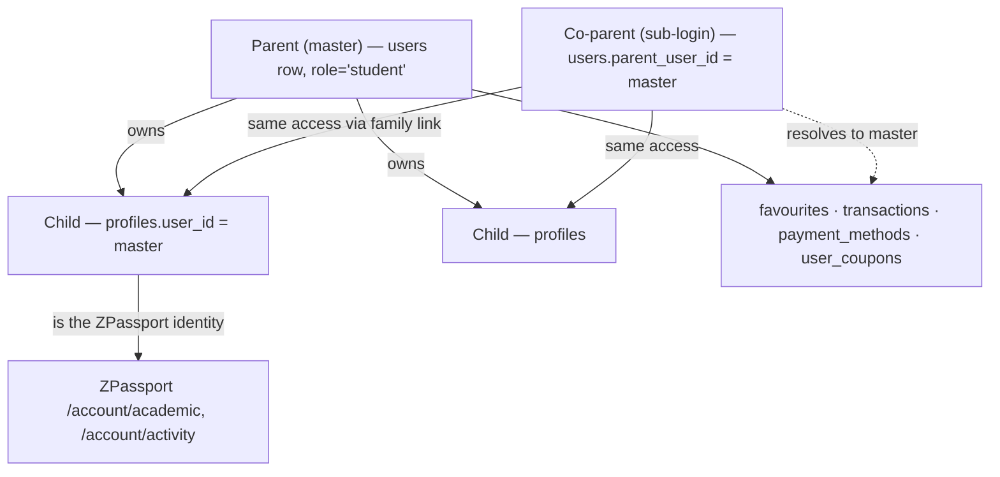

# ADR-006: Parent-Owned Account Hierarchy & Profile Section

| Field | Value |
|-------|-------|
| **Status** | Accepted |
| **Date** | 2026-09-29 |
| **Decision Maker** | mrcoffeespoon |
| **Related** | ADR-005 (reservation flow — `transactions` ledger consumer), ADR-004, `figma prompt/2909/*` (UI blueprint), `docs/UI_Changes_2408.md` |

---

## Context

The student account is being re-framed: **a parent owns the account and manages their children under it** — the thing bound to ZPassport becomes a *child* profile. This inverts the old mental model where the logged-in "student" was the person. The UI blueprint is the **`figma prompt/2909/`** capture set (treated as the pixel source): `Profile-about_me`, `Profile-child_profile` (+ `(1)` variant), `Profile-add_child_profile`, `Profile-add_payment_method`. Frame names quoted by the user map to these captures.

Verified current state (2026-09-29):

- **`users`** (`role='student'`, `parent_user_id` master/sub logins, `country_code`, `mobile`) — no parent photo, address, or language preference; **no verification columns** (`verification_codes` covers email/mobile *change* OTP only).
- **`profiles`** = the children (already the ZPassport source via `studentController.getPassport`): `full_name, date_of_birth, sex, photo_url, school, level, id_first_four/id_last_four, medical_notes…` — **no emergency contact, no SEN flag, no Zschool, no full HKID**.
- **Favourites are fake**: `lib/saved-courses.ts` is localStorage keyed by email; courses only; no centre heart.
- **Money** lives in `orders` (token packages; `payment_status, total, profile_id, stripe_checkout_session_id`) and — after ADR-005 — reservation payments; **no ledger, no Stripe Customer, no saved payment methods** (`paymentController` does Checkout Sessions + webhook only).
- **`coupons`** is a centre-scoped code catalogue — **no per-user ownership table**.
- Admin Members UI already nests sub-login rows under masters (`adminUserController.finishSubs`).

Resolved by grilling on 2026-09-29. Figma-vs-spec deltas recorded inline: the user added **address** + **profile pic** to About me (capture shows only Country/phone prefix), added the **promocode toggle** to Transactions (not in capture), overrode the capture's **bank-form** "Add payment method" modal with a **credit card** flow, and noted the child-card **Zschool connect** button is a placeholder (no plan — record only).

---

## Account Model



**Key infra implication:** every child read/write and every parent-resource query resolves `userId → family owner` first (`resolveFamilyOwnerId(userId)` — returns the sub-login's master or the user itself). This helper is the backbone of the whole section.

---

## Decision Summary

| # | Decision | Choice |
|---|----------|--------|
| 1 | Master/sub logins | **B — co-parent access to the SAME children** via `parent_user_id` |
| 2 | Role naming | **A — `role='student'` stays; "parent" is the UI label** |
| 3 | Child schema | HKID **split-on-input** (fragments only); 🆕 emergency contact, SEN flag, Zschool placeholder; derived age/years/badge |
| 4 | Parent fields & verification | 🆕 `photo_url, address, locale`; **verification on hold** — email treated as always verified, phone stubbed |
| 5 | Transactions | **A — new `transactions` ledger** (denormalized receipt rows, backfilled from `orders`) |
| 6 | Saved payment methods | **A+i — Stripe Customer + setup-mode Checkout**; bank-form deferred (future refund destination) |
| 7 | Promocodes | **A — `user_coupons` ownership + claim-by-code** |
| 8 | Favourites | **A — DB table + one-time localStorage merge**; heart on centres too |
| 9 | Routing | **A — 4 new pages**, `/account/home` → redirect, login → `/account/profile`; **in-page sidebar**, existing Delete/Logout/Help untouched |

---

## Decision 1: Co-parent access (master/sub = one family)

**Decision:** The parent (master) owns the account and the children (`profiles.user_id` = master). A sub-login (`users.parent_user_id` = master) is a **co-parent of the same children**: all child and parent-resource endpoints resolve to the master before acting. The admin Members nesting survives with this meaning ("sub" = co-parent, not a separate family).

### Alternatives Considered

| Option | Pros | Cons | Verdict |
|--------|------|------|---------|
| **B: co-parent access (chosen)** | Real-world correct (both parents manage the same kids); reuses the dormant `parent_user_id` column; admin nesting preserved | Authz surface doubles — `resolveFamilyOwnerId()` required in every children/parent query path | ✅ |
| A: one login per family, retire sub-logins | Simplest model | Second parent loses access; migration for any real sub rows | ❌ |
| C: leave sub-logins as separate families | Zero work | Two parents of one child = two disconnected accounts — wrong | ❌ |

### Consequences
- **Positive:** both parents see and manage the same children; no data migration needed (column already links them).
- **Negative:** every endpoint in this section must resolve family ownership; a missed check = one parent editing invisible data (or worse, another family's).
- **Review trigger:** 3+ caregivers / helper / grandparent access → promote to an explicit `families` table.

---

## Decision 2: `role='student'` stays; "parent" is a UI label

**Decision:** No role migration. The internal role string, `/api/student` mount, portal type and API prefix stay as-is; parent-ness is expressed by owning children and by the new parent-level *fields* (Decision 4). `normalizeRole()` keeps mapping legacy `'parent'` → `'student'`.

### Alternatives Considered

| Option | Pros | Cons | Verdict |
|--------|------|------|---------|
| **A: keep `'student'` (chosen)** | Zero churn across routes/tokens/admin filters | Semantic debt (code says student, product says parent) | ✅ |
| B: migrate to `role='parent'` | Honest domain model | Blast radius: auth tokens, portal routing, admin lists, seeds — riding on an already-large feature | ❌ for now |
| C: dual values going forward | — | Two spellings forever | ❌ |

### Consequences
- **Positive:** feature scope stays focused on data + UI.
- **Negative:** naming debt documented here, not fixed.
- **Review trigger:** any feature that checks "is this user a parent" as a *permission* → do the rename then.

---

## Decision 3: Child profile schema — Figma fields onto `profiles`

**Decision:** Extend `profiles` (the single source of children — ZPassport keeps reading it; the new pages write it). The add/edit modal manages exactly the Figma fields; **the full HKID is accepted as input but never stored** — only the existing `id_first_four` / `id_last_four` fragments persist.

### Schema delta (`profiles`)

| Column | Type | Notes |
|--------|------|-------|
| `emergency_contact_name` | VARCHAR(255) NULL | 🆕 |
| `emergency_contact_phone` | VARCHAR(50) NULL | 🆕 |
| `emergency_contact_country_code` | VARCHAR(8) DEFAULT `'+852'` | 🆕 |
| `sen_assistance` | TINYINT(1) DEFAULT 0 | 🆕 drives the card SEN badge |
| `zschool_connected` | TINYINT(1) DEFAULT 0 | 🆕 **display-only placeholder** — the Connect button is not functional (recorded, not implemented) |

Derived, not stored: `age` ← `date_of_birth`; `years on ClassZ` + year badge ← `created_at` (`<1yr = "Beginner"`, `≥1yr = "Achiever"` — extensible tiers); card photo ← `photo_url`; sex ← `sex`.

### Alternatives Considered

| Option (HKID) | Pros | Cons | Verdict |
|--------|------|------|---------|
| **B: split-on-input (chosen)** | Figma-identical UX; no child-HKID custody (PDPO liability); admin fragments already built around them | Full number unrecoverable — parents re-enter if ever truly needed | ✅ |
| A: store full `hkid_number` | Verification-ready | Custodian of children's HKIDs without a feature that needs them | ❌ |
| C: encrypted column | Protected + usable | Key management is its own project | ❌ |

Legacy columns (`nick_name, parents_name, level, school, student_id, medical_notes, residential_district, contact_number`) **stay untouched** — still consumed by ZPassport/centre CRM. "Single source" means one *table*, not that legacy fields vanish.

### Consequences
- **Positive:** no sensitive-data liability; children data unified for both surfaces.
- **Negative:** HKID re-entry if full-number verification ever arrives; Zschool is a rendered placeholder until that partnership exists.
- **Review trigger:** centre/government program requesting full HKIDs → revisit A/C with a real custody plan; Zschool partnership → real connect flow.

---

## Decision 4: Parent-level fields — verification on hold

**Decision:** New `users` columns: `photo_url TEXT`, `address VARCHAR(255)`, `locale VARCHAR(10) DEFAULT 'en'` (persists the language option). **Verification implementation is on hold**: email is *treated as always verified* (users verify at signup) so the About-me "Verified" badge renders unconditionally; the phone "Verify" button is present but non-functional ("coming soon"). No `email_verified_at`/`phone_verified_at`, no new OTP purposes in this build.

Stats on About me (derived): Children = `COUNT(profiles)` of the family; **Bookings = `COUNT(class_enrollments)` for the family's children + `COUNT(trial_applications)`** (covers program lessons, workshops, trials); Years on ClassZ = `users.created_at`.

### Alternatives Considered

| Option (verification) | Pros | Cons | Verdict |
|--------|------|------|---------|
| **Hold (chosen, user decision)** | Focus; email already verified-at-signup by policy | Verify button is dead UI; `verification_codes` machinery idle | ✅ |
| Email OTP real, phone stubbed | Reuses OTP infra | Build cost now, value later | ❌ deferred |
| Both real (SMS vendor) | Full design parity | New paid vendor for a badge nobody needs yet | ❌ |

### Consequences
- **Positive:** parent identity data is real (photo, address, locale) without a verification sub-project.
- **Negative:** if signup-time email verification isn't actually airtight, the badge lies; phone trust is unearned.
- **Review trigger:** Stripe off-session charges / receipts need a genuinely verified email → implement `email_verified_at` then; SMS gateway chosen → phone flow.

---

## Decision 5: `transactions` ledger

**Decision:** New `transactions` table — one denormalized receipt row per money event, written at payment events (Stripe webhook success, refunds) and **backfilled from `orders`** (token-package purchases included: every dollar the parent paid appears).

| Column | Notes |
|--------|-------|
| `user_id`, `profile_id NULL` | family + which child |
| `amount INT`, `status ENUM('pending','successful','refunded','failed')` | |
| `source_type ENUM('order','reservation')`, `source_id` | provenance |
| `program_name`, `coach_name`, `lessons_count NULL`, `period_start NULL`, `period_end NULL`, `note NULL` | Figma receipt fields — snapshots of what was true at payment time |
| `paid_at`, `created_at`, `updated_at` | |

The Transactions page reads **only** this table: search by child name + status filter ("All"). Pending rows render "Payment pending" per the capture.

### Alternatives Considered

| Option | Pros | Cons | Verdict |
|--------|------|------|---------|
| **A: ledger (chosen)** | One query feeds the page; snapshots match the receipt design; future money events just add rows | Dual-write discipline (webhook writes order + transaction); backfill migration | ✅ |
| B: UNION view over `orders` + enrollment data | No new table | Heterogeneous schemas, clashing status vocabularies, no snapshot home, ugly pagination | ❌ |
| C: stretch `orders` into the ledger | One existing table | `orders` is token-package-shaped; bends its semantics for every existing reader | ❌ |

### Consequences
- **Positive:** receipts are immutable history — program renames and coach departures don't rewrite the past; promocode discounts (Decision 7) get a natural home later.
- **Negative:** every payment path must remember to write the ledger (ADR-005 webhook + refund paths are the first writers).
- **Review trigger:** new payment kinds (subscriptions, saved-card off-session charges) — add `source_type` values, don't fork the table.

---

## Decision 6: Saved payment methods — real Stripe cards, bank form deferred

**Decision:** Stripe **Customer** per parent (`cus_…`) on first save. "Add payment method" redirects to a **setup-mode Checkout Session** (same redirect pattern as ADR-005 payments); the webhook receives the confirmed setup, retrieves the PaymentMethod, and upserts:

```
payment_methods (
  id, user_id, stripe_customer_id, stripe_payment_method_id UNIQUE,
  brand, last4, exp_month, exp_year, is_default, created_at
)
```

Cards are stored by Stripe only — the app holds brand + last4 + tokens, exactly what the capture's `Mastercard 8888 **** **** 8888` row needs. The capture's **bank-form modal is deferred** (user overrode it with "credit card"); recorded as a future **refund destination** feature (HK FPS transfer refunds) — bank details would be stored masked and processed manually, never as a payment source.

### Alternatives Considered

| Option | Pros | Cons | Verdict |
|--------|------|------|---------|
| **A: Customer + setup-mode Checkout (chosen)** | Reuses existing Checkout + webhook pattern; cards chargeable off-session later | Redirect UX (not embedded like the design implies) | ✅ |
| B: display-only (capture last4 from payments) | Cheap | A saved card you can't pay with | ❌ |
| C: Setup Intent + Payment Element embedded in the modal | Matches the design's in-modal feel; nicer UX | Real Stripe.js frontend work now | ❌ v1 — schema-compatible upgrade later |
| D: Stripe Billing Portal | Zero UI work | No control, off-design | ❌ |

### Consequences
- **Positive:** foundation for one-click off-session reservation payments (ADR-005 v2); PCI stays entirely with Stripe.
- **Negative:** redirect round-trip for a "modal" action; webhook must handle `checkout.session.completed` for setup mode distinctly from payment mode.
- **Review trigger:** parents complaining about the redirect → upgrade to Setup Intent + Payment Element (no schema change); ADR-005 payment UX → off-session charge with default method.

---

## Decision 7: `user_coupons` — ownership + claim-by-code

**Decision:** New table `user_coupons (id, user_id, coupon_id FK, status ENUM('available','used','expired'), claimed_at, used_at, used_transaction_id NULL, UNIQUE(user_id, coupon_id))`. The Transactions page gains a **promocode toggle section** (user addition, not in the capture) listing owned codes — code, centre, discount, status. Claim flow: parent enters a code → validated against `coupons` (active, valid window, `quantity` remaining) → row created. Spending a coupon at checkout is **out of scope** (recorded); grant-style issuance (ClassZ-issued credits) can ride the same table later.

### Alternatives Considered

| Option | Pros | Cons | Verdict |
|--------|------|------|---------|
| **A: ownership + claim (chosen)** | Real "codes you have"; section has content; checkout redemption later just flips status | One table + claim endpoint | ✅ |
| B: browse-only active `coupons` | Zero schema | "Have" is fake — everyone sees every centre's codes | ❌ |
| C: defer toggle | — | Shipping an empty section by design | ❌ |

### Consequences
- **Positive:** ownership data exists before the redemption feature needs it.
- **Negative:** claimed-but-unspendable codes until checkout redemption lands — set expectations in copy ("usable at checkout soon").
- **Review trigger:** checkout payment flow gains a discount field → wire `user_coupons.used_at`/`used_transaction_id` + `coupons.used_count` increment.

---

## Decision 8: `favourites` — real data, localStorage merged once

**Decision:** New table `favourites (id, user_id, item_type ENUM('course','centre'), item_id INT, created_at, UNIQUE(user_id, item_type, item_id))` — programs/workshops/trials are all `courses` rows (split by `course_type` at display time), centres are `centers` rows. Toggle endpoint + list endpoint + bulk import. The heart on `CentreCard` is new; course hearts switch from localStorage to the API when logged in. **One-time merge on first authenticated load**: read the localStorage ids → import endpoint → clear the key; guests keep the current localStorage behaviour.

Favourites list page: mixed list, newest first, each row linking to its detail page (`/programs/:id`, `/workshops/:id`, `/trials/:id`, `/centres/:id`) with inline heart-to-remove. Child cards get **no ZPassport cross-link in v1** (surfaces separate; default decision, vetoable).

### Alternatives Considered

| Option | Pros | Cons | Verdict |
|--------|------|------|---------|
| **A: DB + one-time merge (chosen)** | Nobody loses hearts; clean cut after one visit | ~20-line import + batch endpoint | ✅ |
| B: DB, abandon localStorage | Simplest | Silently deletes existing users' hearts | ❌ |
| C: localStorage forever | — | Not real data; no cross-device | ❌ |

### Consequences
- **Positive:** favourites become server-side, cross-device, and feed future features (recommendations, "back in stock" style nudges).
- **Negative:** two heart implementations (guest local / user API) must coexist until sunset.
- **Review trigger:** recommendation or notification features → favourite counts per item become useful aggregates.

---

## Decision 9: Routing — 4 new pages, in-page sidebar, minimal collateral

**Decision:** New pages under the existing gate: `/account/profile` (About me — **replaces** the old personal-info page), `/account/children`, `/account/transactions`, `/account/favorites`. `/account/home` becomes a redirect to `/account/profile`; **login redirects parents to `/account/profile`**. ZPassport pages (`/account/academic/*`, `/account/activity/*`) are untouched and remain top-nav-reachable. The **profile sidebar is a separate in-page component** (per the captures — *not* the hamburger): About me / Child profile / Transactions / Favorites + **links only** to the existing Help centre, Delete account (`/delete-account`) and Log Out flows — those three surfaces are not modified by this build. Any internal links to `/account/home` get retargeted.

### Alternatives Considered

| Option | Pros | Cons | Verdict |
|--------|------|------|---------|
| **A: as above (chosen)** | Matches "login → About me"; no deep-link breakage | Old dashboard retired | ✅ |
| B: keep `/account/home` as landing | — | Two competing landings; contradicts spec | ❌ |
| C: fresh `/account/parent/*` namespace | Clean cut | Breaks existing `/account/academic/*` deep links for no visible gain | ❌ |

### Consequences
- **Positive:** the four new surfaces live beside (not inside) ZPassport; removal of an old landing instead of one more orphan.
- **Negative:** `/account/home` bookmarks redirect; old personal-info page disappears (fields absorbed).
- **Review trigger:** if a dashboard need re-emerges, it's a new design conversation — not a resurrection.

---

## Consequence Summary

### Schema Changes Required

| Change | Table | Risk |
|--------|-------|------|
| + `emergency_contact_name/phone/country_code`, `sen_assistance`, `zschool_connected` | `profiles` | Low |
| + `photo_url`, `address`, `locale` | `users` | Low |
| CREATE `transactions` (ledger + backfill from `orders`) | new | Medium — dual-write discipline starts at ADR-005 webhook |
| CREATE `payment_methods` | new | Low |
| CREATE `user_coupons` | new | Low |
| CREATE `favourites` (+ import endpoint) | new | Low |

### New API Endpoints (all family-scoped via `resolveFamilyOwnerId`)

| Endpoint | Purpose |
|----------|---------|
| `GET /api/student/me/summary` | About-me stats (children, bookings, years) |
| `PATCH /api/student/me` · `POST /api/student/me/photo` | Parent name/address/locale/photo |
| `GET / POST / PATCH /api/student/children(/:id)` | Child CRUD (HKID → fragments; modal fields) |
| `GET /api/student/transactions?search=&status=` | Ledger list |
| `GET / POST(setup) / DELETE /api/student/payment-methods(/:id)` | Saved cards; webhook handles setup-mode completion |
| `GET /api/user/coupons` · `POST /api/user/coupons/claim` | Owned promocodes + claim-by-code |
| `GET / POST(toggle) / POST(import) /api/student/favourites` | Favourites |

### New UI Pages / Components

| Surface | Notes |
|---------|-------|
| `components/account/profile-sidebar.tsx` | In-page sidebar (4 sections + 3 links to untouched flows) |
| `/account/profile` | About me: stats, personal info form, photo, language |
| `/account/children` | Child cards + add/edit modal (Figma modal fields) |
| `/account/transactions` | Saved methods strip, search + status filter, ledger rows, promo toggle |
| `/account/favorites` | Mixed list, newest first |
| Login redirect · `/account/home` | → `/account/profile` |
| `CentreCard` | + heart (favourite toggle) |

---

## Open Items (recorded, deliberately not built)

1. **Zschool connection** — Connect button placeholder (`zschool_connected` renders state only).
2. **Verification** — email assumed verified at signup; phone verify stubbed.
3. **Bank-form / refund destination** — future feature; never a payment source.
4. **Coupon redemption at checkout** — table ready, flow later.
5. **Off-session saved-card payments** — the ADR-005 reservation flow's one-click future.
6. **Child card → ZPassport cross-link** — no link in v1 (default).

---

## Review Triggers

| Condition | Revisit |
|-----------|---------|
| 3+ caregivers / helpers per family | D1 → `families` table |
| Role-based parent permissions needed | D2 → rename `role='parent'` |
| Full-HKID required by a program/partner | D3 → custody plan before storing |
| Stripe off-session charges or receipts | D4 → real email verification first |
| Checkout gains discounts | D7 → wire `user_coupons` redemption |
| Redirect UX complaints / ADR-005 one-click pay | D6 → Setup Intent + Payment Element; off-session charge |
| Recommendation/notification features | D8 → favourite aggregates |
