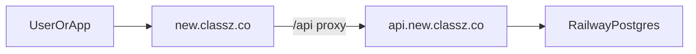

# ClassZ Deployment Cutover Guide

This guide matches the current redevelopment setup:

- Backend: Railway
- Frontend: Vercel
- DNS: Namecheap
- Temporary API URL: `https://classz-api-production.up.railway.app`
- Final API URL: `https://api.new.classz.co`
- Final website URL: `https://new.classz.co`

## Architecture



## 1. Backend on Railway

The API repo already includes:

- start command: `npm start`
- health check: `/api/health`
- Railway config: `railway.json`

Required Railway variables:

```env
DATABASE_URL=${{Postgres.DATABASE_URL}}
JWT_SECRET=your-long-random-secret
NODE_ENV=production
```

One-time DB init:

```bash
cd ~/Desktop/Jason/ClassZ/ClassZ-api
railway link
railway run npm run db:init
```

Verify:

- `https://classz-api-production.up.railway.app/api/health`

## 2. Frontend on Vercel

Deploy `ClassZ-Website` to Vercel, not GitHub Pages.

Initial production env in Vercel:

```env
BACKEND_URL=https://classz-api-production.up.railway.app
NEXT_PUBLIC_CLASSZ_API_URL=https://classz-api-production.up.railway.app
```

Why both:

- `BACKEND_URL` powers the Next.js proxy route
- `NEXT_PUBLIC_CLASSZ_API_URL` keeps shared client logic aligned

The proxy route is:

- `app/api/[...path]/route.ts`

It forwards browser requests to `BACKEND_URL`.

## 3. Namecheap DNS

### Website

In Vercel, add:

- `new.classz.co`
- `www.new.classz.co`

Then copy the exact DNS records Vercel shows into Namecheap.

### API

In Railway, add custom domain:

- `api.new.classz.co`

Then in Namecheap add:

| Type | Host | Value |
|------|------|-------|
| CNAME | `api.new` | `classz-api-production.up.railway.app` |

No `https://`, no `/api`.

## 4. Wait for SSL

Do not switch the frontend to `api.new.classz.co` until Railway shows SSL as active.

Test:

- `https://api.new.classz.co/api/health`

## 5. Switch frontend to custom API domain

After SSL is active, update Vercel env:

```env
BACKEND_URL=https://api.new.classz.co
NEXT_PUBLIC_CLASSZ_API_URL=https://api.new.classz.co
```

Redeploy Vercel.

## 6. Mobile app

Use the same API base URL:

- temporary: `https://classz-api-production.up.railway.app`
- final: `https://api.new.classz.co`

## 7. Cutover checklist

1. Railway API health returns 200
2. Railway DB is initialized
3. Vercel preview can reach Railway API
4. `new.classz.co` points to Vercel with valid SSL
5. `api.new.classz.co` points to Railway with valid SSL
6. Vercel env switched to `https://api.new.classz.co`
7. Website login, admin, teachers, and tasks all work
8. App uses the same backend

## Notes

- Leave old `classz.co` and old `api.classz.co` alone until the new stack is stable.
- GitHub remains the code host only.
- GitHub Pages is not suitable for this Next.js frontend.
