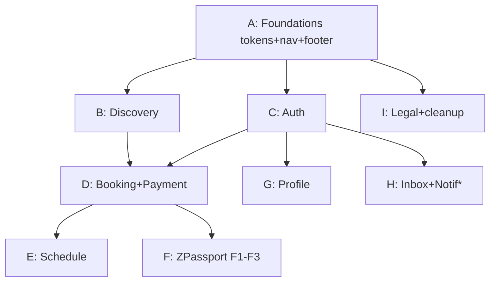

# ClassZ Website — UI Implementation Plan

Status: **Draft for review** · Branch: `frontend/lucas` · Date: 2026-08-21

This plan breaks the Figma rebrand ("ClassZ Rebrand (Mobile)" → *Website* canvas, desktop 1440px) into workable UI blocks, ordered so each block is independently shippable. It is based on:

- `ClassZ-Website tech Doc.md` (setup/build/deploy guide — architecture + constraints)
- Figma file `GmdFYzfDwKyURdqdeUnGx2`, canvas `1445:16015` "Website" (~45 named frames incl. modals/popovers)
- Current repo inventory: 59 `page.tsx` routes (48 admin, 11 public/marketing)

---

## 1. Architecture constraints (from tech doc)

| Fact | Implication for UI work |
|---|---|
| Next.js 16 + React 19 + Tailwind v4 (CSS-first tokens in `app/globals.css`) | Design tokens go in `@theme`, no tailwind.config |
| Frontend talks to API via Next proxy `app/api/[...path]/route.ts` → `BACKEND_URL` (:3003 local) | Never call `:3003` from browser code; use `/api/...` + `lib/classz-api-client.ts` |
| Production: Vercel (frontend) + Railway (API + PostgreSQL) | No server-only assumptions in client components |
| **`next.config.mjs` ignores TS errors during build** | `npm run lint` + Zed diagnostics are the real gate, not `npm run build` |
| `/uploads/*` rewritten to backend | Images from API use `/uploads/...` paths directly |
| Frontend has demo-data fallback (`lib/classz-admin-demo.ts`) | Fake data can mask API failures — check network tab when testing |
| Copy lives in `locales/` via `t()` (en + zh-TW) | Every new screen adds locale keys; no hardcoded strings in components |

## 2. Where things live

- Tokens: `app/globals.css` (+ `styles/globals.css` for admin — keep in sync)
- Shared UI: `components/` (marketing) · `components/ui/` (primitives, currently only `button.tsx`)
- Pages: `app/<route>/page.tsx`
- API client: `lib/classz-api-client.ts`, `lib/backend-origin.ts`
- Images: `public/`

## 3. Design system foundations (extracted from Figma)

| Token | Value(s) | Notes |
|---|---|---|
| Primary | Aqua Teal/500 `#0ABAB5` | unchanged from current `--classz-400` |
| Teal tint | Aqua Teal/100 `#D7F4F3` | replaces `--classz-50 #e7f8f7` |
| Ink / body | `#222222` (Shade 02) | replaces slate `#4C5B5C` |
| Neutrals | `#EBEBEB #E0E0E0 #CCCCCC #A3A3A3 #717171 #525252 #292929` | replaces slate ramp |
| Semantic | Success/Discounts `#008A05` · Warning/200 `#FBF0D8` · Error/200 `#F3C5C1` | soft fills for badges/alerts |
| Accent | `#FFC943` (Figma global var) | used sparingly (ratings stars etc.) |
| Shadow | `0 6px 16px rgba(0,0,0,0.12)` | cards + popovers (confirmed in Figma `effect_e2f8fa42`) |
| Radii | cards `12px` · modals `24px` · inputs `8px` · pills `100px` | popovers = 12 |
| Font | SF Pro 400/510/590/700 | **cannot self-host** (Apple license) → `-apple-system` stack; Inter is the licensed-safe alternative |
| Icons | Vuesax line set | repo currently uses `lucide-react`; either swap set or keep lucide equivalents |
| Layout | 1440 canvas · 80px side padding · 32px section gap · footer `#222` (120/80/64 pad, 120px col gap) | |

> ⚠️ Marketing pages + admin currently use slate ink + Poppins. Token changes propagate site-wide — that is the intent (rebrand), but expect visual diffs on admin pages. Verify nothing becomes unreadable.

## 4. UI flow → workable blocks

The Figma connector lines describe the happy path:
**Landing → Programs → detail → booking-for → Payment → success → Schedule / ZPassport**, with auth branching from nav, and Profile/Inbox as secondary destinations.

### Block A — Foundations & shell 　`prep, no screens` — ✅ DONE (2026-08-21)
- Retune tokens in `app/globals.css` (§3): keep all existing aliases (`--classz-*`, `--brand-*`, `--crm-*`) working; admin (`styles/globals.css`) inherits.
- Font stack → SF-substitute; decide Poppins removal in `app/layout.tsx`.
- Rebuild **Navbar** (`components/navbar.tsx`) from "Landing Page-menu bar" `#1445:16016`: hamburger, logo, Home / About Us / Programs / Workshops, Log In.
- Rebuild **Footer** ("Below thingy" `#1647:16416`): `#222` bg, Contact / Support / Apps / Language columns.
- Primitives in `components/ui/`: input (label/helper/error variants — see input component set `#1593:16490`), card (r12 + shadow), pill button (r100), modal (r24), popover (r12), arrow buttons (`#1595:16500/16534`).
- **Playwright scaffolding** (see §7): `@playwright/test` dev dep, `playwright.config.ts` (webServer reusing `localhost:3000`), `e2e/` dir, auth fixture + helpers.
- **DoD:** tokens applied, nav+footer on existing pages, `npm run lint` clean, no unreadable admin pages, Block A suite green.

### Block B — Discovery (public browse) — ✅ DONE 2026-08-21 (centres + ratings deferred, see notes)
| Screen | Figma node | Route | Status |
|---|---|---|---|
| Landing Page | `#2346:21370` | `/` | ✅ built (replaces redirect; ZPassport section + real "New Programs" cards; "Trending Workshop" hidden until workshop data exists) |
| Programs listing | `#1582:16181` | `/programs` | ✅ built (search + Place filter live) |
| Program detail | `#1895:7672` | `/programs/[id]` | ✅ built (id-based, not slug — matches API; class "options" cards from `/api/classes`; Enroll → `/login` until Block D) |
| Workshops listing | `#1988:7449` | `/workshops` | ✅ built (variant of programs listing; `course_type ∈ {short_term, summer}` — API has no `workshop` type; empty state shows until data seeded) |
| Workshop detail | `#1988:7824` | `/programs/[id]` | ✅ shared with program detail (no separate route needed) |
| Centre View | `#2471:14635` | `/centres/[id]` | ⛔ **blocked: no public centres endpoint in API** (`GET /api/centers` → 404; only `POST /api/public/centers/register`) |
| Centre profile-programs | `#2568:10769` | `/centres/[id]` | ⛔ same |
| Ratings & review | `#2511:19386` | section on detail | ⛔ **blocked: no ratings endpoint**; card/detail rating UI slots omitted until data exists |

**Block B API gaps found (backend tasks needed):**
1. `GET /api/centers` + `GET /api/centers/:id` (public) — centres table exists, no public route.
2. Ratings/reviews endpoints (or hide ratings across UI).
3. Courses listing lacks `price`/`image`/`category` fields — cards show placeholder image, no price; sidebar Category section is disabled; Language/Price/Rating/Service filter sections omitted (documented in `components/programs/filter-sidebar.tsx`).
4. No `workshop` course_type — workshops mapped to `short_term`/`summer`.

Includes region filter components ("Kowloon expand" `#1977:20197`, "New territories expand" `#1977:20334`, "options" `#1981:7660`).
**API check first:** public program/centre listing + detail endpoints in `ClassZ-api-main/routes` (admin `courses`/`centers` exist; public wrappers may not).
**Done:** `lib/public-courses.ts` (server fetch, no demo fallback) · `lib/locations.ts` (district catalog) · `components/programs/*` · `app/{programs,programs/[id],workshops}` · landing assets in `public/landing/` (compressed JPG) · `e2e/block-b.spec.ts` 14 tests green.

### Block C — Auth
⚠️ **Two generations exist in Figma — confirm canonical set with designer before building.**
| Gen | Login | Register | Forgot | Reset | Verify |
|---|---|---|---|---|---|
| 1 (900px fixed) | `#1743:7317` | `#1914:8695` | `#1927:18960` | `#1931:19292` | `#1931:19239` |
| 2 (column) | `#1925:18328` | `#1927:18643` | `#2605:22663` | `#2605:23271` | `#2605:22967` |

Routes: `/login` (exists — restyle), `/register`, `/forgot-password`, `/reset-password`, `/verify` (new).
**API check:** register / forgot / reset / verify endpoints; existing `loginIdentifier` flow already works via proxy.

### Block D — Booking & Payment (the conversion funnel)
| Screen | Figma node | Proposed route | Notes |
|---|---|---|---|
| Booking-for selection | `#2032:18429` | modal on detail page | child/timeslot picker |
| Payment | `#1990:8282` / `#2032:18526` / `#2511:26543` | `/payment` | **3 variants — pick current** |
| Promo code modal | `#2611:23699` + `#2511:25194` | modal | 600px r24 |
| Add payment modal | `#2804:18164` | modal | 500px r24 |
| Payment successful | `#2031:8286` | `/payment/success` | |
| Transaction options | `#2673:30577` | popover | 242px r12 |

**API check:** Stripe env vars exist in API (`STRIPE_*`); confirm checkout + coupon endpoints before UI.

### Block E — Schedule (member)
| Screen | Figma node | Route |
|---|---|---|
| Schedule (multi-child) | `#2022:20563` | `/schedule` |
| Schedule-1 child | `#2046:29079` | same, child param |
| Filter popover | `#2046:29743` | popover on `/schedule` |

### Block F — ZPassport (learning record, member)
Largest block — consider splitting F1/F2:
- **F1 Academic:** `#2046:30107` list · `#2110:24935` details · `#2124:25756` expand · `#2159:12907` work examples → `/zpassport/academic/...`
- **F2 Activity:** `#2210:16401` list · `#2210:16658` details · `#2210:16986` expand · `#2210:17174` moments → `/zpassport/activity/...`
- **F3 Learning Companion:** `#2374:23143` home + `#2418:25310` `#2418:25566` `#2429:25945` `#2429:26136` (animal-personality variants; see existing `/learning-companion-samples` + `Learning Companion Sample/` assets) → `/zpassport/companion`
- Child-selection popover `#2383:24810`.
**API check:** learning-records endpoints (admin side exists — parent/student view needed).

### Block G — Profile & account (member)
| Screen | Figma node | Route |
|---|---|---|
| About me | `#2046:30693` | `/profile` |
| Member profile | `#2518:30017` | `/profile` variant (confirm) |
| Child profile | `#2075:19105` / `#2092:23228` | `/profile/children` (2 variants — pick one) |
| Add child | `#2338:19880` | `/profile/children/new` |
| Transactions | `#2078:19449` | `/profile/transactions` |
| Add payment method | `#2078:20644` | modal/page on transactions |
| Favorites | `#2085:21731` | `/profile/favorites` |

### Block H — Inbox & notifications (member)
| Screen | Figma node | Route |
|---|---|---|
| Inbox | `#2429:26770` | `/inbox` |
| Notification centre | `#2465:13645` | `/notifications` or bell dropdown (unnamed `#2471:13950` is likely the dropdown) |

**API check:** inbox/notifications endpoints may not exist in API at all — confirm before UI; if missing, this block needs a backend task first.

### Block I — Legal & migration
- T&C `#2787:17873` → restyle existing `/terms` (+ `/privacy`, `/refund` to match).
- Decide fate of legacy marketing routes (`/our-mission`, `/our-features`, `/partnership`, `/contact-us`, `/faqs`): keep as "About Us" targets or fold into new Landing. Set redirects accordingly (SEO — update `lib/metadata` if routes change).

## 5. Build order

- **Vertical slice first:** A → one screen in B (Landing **or** Programs) end-to-end proves foundations before breadth.
- E/F/G/H are parallelizable after D/C.
- H is *blocked on API check* — may need backend work first.
- Admin (`/admin`) is untouched by this plan except token side-effects from A.

## 6. Per-block working agreement

1. **Prep:** verify API endpoints for the block in `ClassZ-api-main/routes`; confirm ambiguous screens with designer (flagged ⚠️).
2. **Tests first:** write the block's Playwright acceptance suite (§7) against the not-yet-built routes — it should fail. Tests encode Figma behavior as executable criteria.
3. **Build:** route + components + `locales/` keys (en + zh-TW); use `/api` proxy only.
4. **Verify:** block suite green, `npm run lint` clean, Zed diagnostics clean, page works with API up (`localhost:3000` + `:3003`), check real network calls (beware demo fallback), test both locales, keyboard nav on modals/popovers.
5. **Stabilize:** once the block's design is settled, add screenshot baselines (`toHaveScreenshot`) for its screens.
6. **Commit:** one commit per screen/section, message prefix with block letter (e.g. `B: programs listing`).

## 7. Block test matrix (Playwright)

Rationale: the build ignores TS errors (tech doc §6), the demo fallback masks API failures, and blocks stack — E2E suites are the real regression gate.

**Strategy:** functional acceptance tests written at block start; visual (`toHaveScreenshot`) baselines at block end. Assert *seeded* records (not demo data) to prove real API path. Member blocks (E–H) reuse an auth `storageState` fixture logging in via `POST /api/user/login` (`loginIdentifier`, seeded pw `111111`).

| Block | Acceptance tests (write at block start) |
|---|---|
| **A** | navbar links navigate on every public page; hamburger works at mobile viewport; footer columns + links; body font/bg tokens applied; admin pages render with no console errors |
| **B** | landing hero + CTA → `/programs`; listing renders seeded programs; region filter (Kowloon / New Territories) narrows list; detail page renders seeded program + opens booking entry; unknown slug → 404; zh-TW toggle swaps copy |
| **C** | valid login redirects to member home; wrong password shows error state (Error/200 style); register → verification state; forgot → reset happy path; logged-out `/schedule` redirects to `/login`; input label/helper/error variants |
| **D** | booking modal: select child + timeslot → payment; totals computed; promo code modal applies seeded coupon; add-payment modal validates; success page after checkout; no double-submit while pending |
| **E** | requires auth; renders seeded enrolments; multi-child switcher (≥2 children) and 1-child states; filter popover narrows schedule |
| **F** | academic list → details → expand; work examples render; activity list/details/moments; child-selection popover switches companion content |
| **G** | about-me shows account data; add-child form validation + success; transactions list shows seeded order; add payment method modal; favorite/unfavorite updates list |
| **H** | inbox thread list + open conversation; notification bell dropdown; mark notification done *(blocked on API — write as spec, stub via `page.route` until endpoints exist)* |
| **I** | `/terms` `/privacy` `/refund` render in rebrand shell; legacy routes redirect with correct status codes |

**Shared fixtures/helpers (built in A):** `e2e/fixtures/auth.ts` (login → storageState, roles: parent/student), console-error guard, locale-toggle helper, `/api/**` mock helper for hermetic tests.

**Known constraints:** email verification + Stripe checkout aren't fully exercisable locally (SMTP dev-log mode, no local Stripe keys) → intercept `/api/**` for those paths or read token from `MAIL_DEV_LOG`; C/D suites depend on resolving the ⚠️ design questions (auth generation, payment variant) first.

## 8. Open questions (need answers before/during work)

1. **Auth generation** — Gen 1 vs Gen 2 screens (§C)? Same for **Payment ×3** and **Child profile ×2**.
2. **Font** — system SF-stack vs licensed Inter? (affects all text)
3. **Icons** — adopt Vuesax (new dep) or map to existing lucide?
4. **Legacy marketing pages** — keep/rename/redirect after new Landing exists?
5. **Ratings & review** — own page or section on program/centre detail?
6. **API coverage** — inbox/notifications/favorites public-program endpoints: build now or stub?
7. **Git identity** still placeholder (`mrcoffeespoon <asdfghjklqaqlol@gmail.com>`) — fix `user.name`/`user.email` before first push.

## 9. Figma node quick-reference

File `GmdFYzfDwKyURdqdeUnGx2` · canvas `1445:16015` — full IDs in §4 tables. Shared components: footer `#1647:16416`, arrow buttons `#1595:16500`/`#1595:16534`, input set `#1593:16490`, expand/region sets `#1635:17021`/`#1977:20197`/`#1977:20334`.
